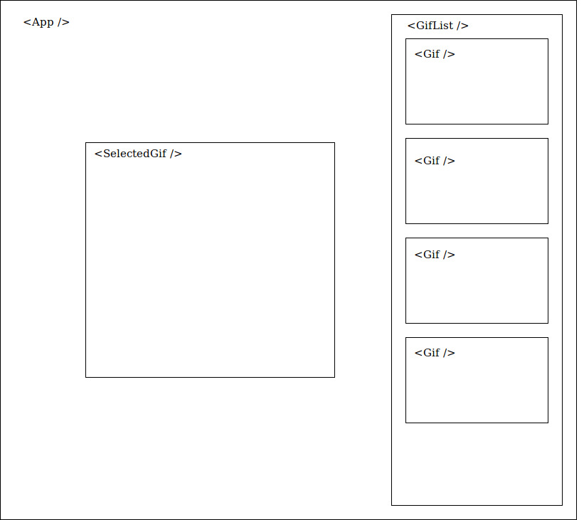
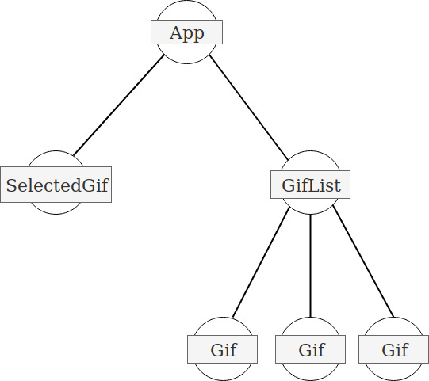

# React Giphy

## Release / Update date
**17/02/2020**

## Description
Create a page that will display a list of gifs and show the selected gif.


1. create the components according to the [diagram](./react-giphy-diagram.jpg):


2. on `App`, fetch from giphy API. **Don't forget to create your API key!**
```http://api.giphy.com/v1/gifs/search?api_key=${apiKey}&q=${query}&limit=5```

3. iterate over a list of 5 gifs, and display the `Gif` on `GifList`.

4. when clicking on a `Gif`, it is displayed on `SelectedGif`

## Requirements
- React props, react state.
- Fetch.

## Author
anelisy.nagano@wildcodeschool.pt

[Slack me](https://app.slack.com/client/T6SG2QGG2/C6SG2QKCJ/user_profile/UHGS5ECF3)